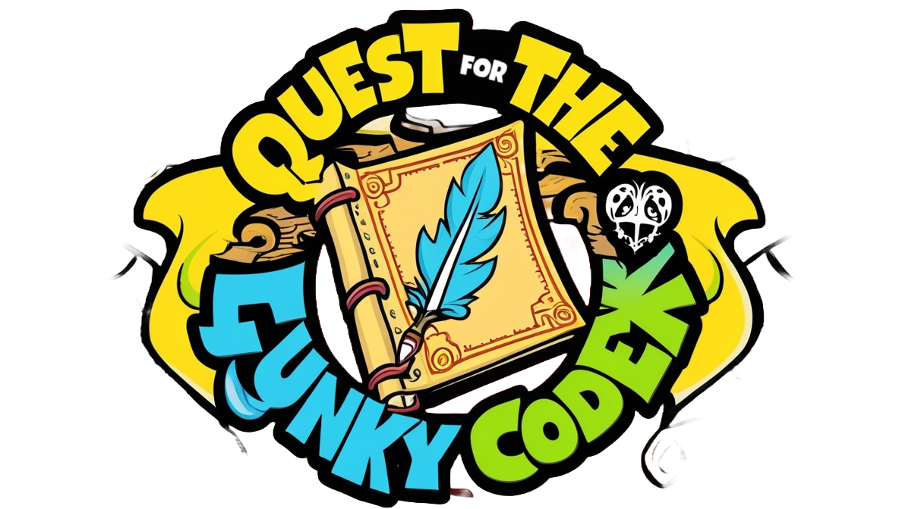
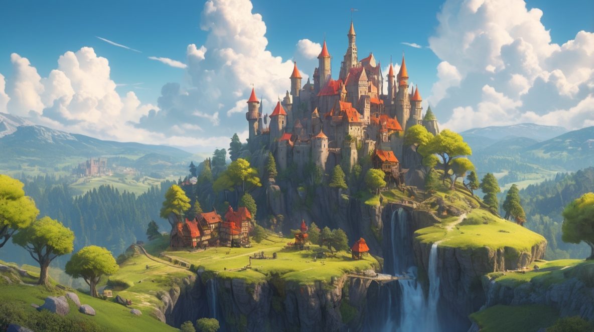

# Quest for the Funky Codex

Groupe de Votre NOM1, Votre NOM2

## Sujet

Une ou deux ligne : expliquez ce que vous avez compris du sujet

## 1. Brainstorming

On utilise le modèle ` deepseek-ai/DeepSeek-R1-Distill-Qwen-32B` pour la génération du texte.
Pour le faire le brainstorming on commence par l'idée suivante :

> Je souhaite faire un jeux vidéo en 3D de type RPG médiéval avec un thème trés cartoon et humoristique.

## 2. Identité

Il nous a proposé de prendre le nom "Quest for the Funky Codex" mais Il était un peu long... Alors on a fait

> I liked the funky. also make sure it remains simple, short and cute

> Title: The Funky Codex Quest

Pour le style et le logo on demande :

> How should the logo, and visual identity reflect the theme and style of the game

> **Logo Design:**
   - **Incorporate Medieval Symbols:** A shield or sword with a cartoony twist.
   - **Color Palette:** Bright, vibrant colors with high contrast to stand out.
   - **Font Style:** Rounded and playful font to emphasize humor.
   - **Consistency:** Ensure the logo remains clear and recognizable in both small and large formats.

Pour l'identité visuelle :

> **Visual Identity:**
   - **Character Design:** Exaggerated features for iconic and endearing characters. Focus on making the main character, Sir Bernoulli, look clumsy yet likable.
   - **Environments:** Vibrant and inviting with distinct biomes. Use earthy tones for natural landscapes and brighter colors for magical elements.
   - **Color Palette:** Mix of earthy greens, browns, and warm oranges with contrasting, vibrant hues for buildings and clothing.
   - **Typography:** Custom medieval-inspired font that is modern, readable, and consistent across all UI elements.

---

On génère le logo avec `Leonardo Phoenix 0.9` :

> Create a whimsical, medieval-inspired icon for "Quest for the Funky Codex" that embodies a playful, vibrant, and cartoonish aesthetic. The design should feature a unique blend of fantasy and humor. Incorporate bold, bright colors such as sunny yellow, sky blue, and lime green to evoke a sense of wonder and adventure. At the center of the design, feature an ornate, stylized codex with intricate quill pen illustrations, surrounded by cryptic symbols and mysterious scrolls. The codex should appear as a tool for decoding ancient messages or unlocking hidden knowledge.

Résultat choisi :

On a utilisé GIMP et [Adobe Background Remover]
(https://www.adobe.com/express/feature/image/remove-background) pour avoir le logo simple :

## Concept Art

On vas d'abord définir les personnages et le monde :

> I want to make concept art. Please give me image prompts for world and characters

Mais la réponse était bien trop détaillée

> Give me one prompt for the world and one for the characters Make it short and simple

Réponse :

>  World Design Prompt:
> "A vibrant, whimsical medieval landscape with rolling hills, forests where trees seem to smile, and castles that appear slightly off-kilter but still majestic. The sky is bright with floating islands and magical elements like glowing clouds or flying creatures. The overall feel is playful and colorful, capturing the essence of a cartoonish, adventurous world."

> Character Design Prompt:
> "Endearing characters with exaggerated features—think a brave yet clumsy knight, a sassy princess, a quirky druid, a warrior from another planet, and a robot paladin with a funny twist. Each character should have big, expressive eyes, silly poses, and whimsical accessories that make them unforgettable."

On a ensuite passé ça dans Leonardo concept-art `Finetuned Model AlbedoBase XL`

Pour le personnage, il a fallut qelque itérations :

> (full body), (concept character sheet:1.5), (illustration:1.3) Roland (Robot Paladin)
> A ridiculously cartoonish robot knight with oversized, ornate wooden gears, bright copper plating, and super-bright glowing brass accents. His armor is hilariously mismatched (e.g., one arm made of polished wood with a big red "W" on it and the other made of copper-plated metal with a giant gear sticking out). He has a comically exaggerated expression, with a gigantic toothy grin and crossed eyes, as if he's trying way too hard to be a proper knight but keeps getting his steam-powered contraptions tangled in absurd ways. Add details like a tiny steam-powered bird sitting on his shoulder playing a miniature trumpet or a giant wooden gear sticking out of his helmet with a silly propeller on top. key visual, character design, clean detailed face, intricate clothing, vivid, sharp focus, depth of field, clean image, high quality, high detail, HD, (high definition), key visual, concept art, smooth, masterpiece, illustration, sharp focus, highly detailed, dynamic pose, solid color background, bright, bold, white background

.jpg)

