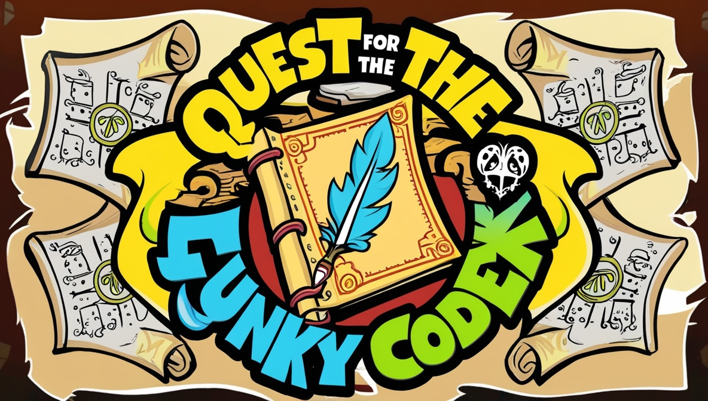

# Quest for the Funky Codex

Groupe de Votre NOM1, Votre NOM2

## Sujet

Une ou deux ligne : expliquez ce que vous avez compris du sujet

## 1. Brainstorming

On utilise le modèle ` deepseek-ai/DeepSeek-R1-Distill-Qwen-32B` pour la génération du texte.
Pour le faire le brainstorming on commence par l'idée suivante :

> Je souhaite faire un jeux vidéo en 3D de type RPG médiéval avec un thème trés cartoon et humoristique.

## 2. Identité

Il nous a proposé de prendre le nom "Quest for the Funky Codex" mais Il était un peu long... Alors on a fait

> I liked the funky. also make sure it remains simple, short and cute

> Title: The Funky Codex Quest

Pour le style et le logo on demande :

> How should the logo, and visual identity reflect the theme and style of the game

> **Logo Design:**
   - **Incorporate Medieval Symbols:** A shield or sword with a cartoony twist.
   - **Color Palette:** Bright, vibrant colors with high contrast to stand out.
   - **Font Style:** Rounded and playful font to emphasize humor.
   - **Consistency:** Ensure the logo remains clear and recognizable in both small and large formats.

Pour l'identité visuelle :

> **Visual Identity:**
   - **Character Design:** Exaggerated features for iconic and endearing characters. Focus on making the main character, Sir Bernoulli, look clumsy yet likable.
   - **Environments:** Vibrant and inviting with distinct biomes. Use earthy tones for natural landscapes and brighter colors for magical elements.
   - **Color Palette:** Mix of earthy greens, browns, and warm oranges with contrasting, vibrant hues for buildings and clothing.
   - **Typography:** Custom medieval-inspired font that is modern, readable, and consistent across all UI elements.

---

On génère le logo avec `Leonardo Phoenix 0.9` :

> Create a whimsical, medieval-inspired icon for "Quest for the Funky Codex" that embodies a playful, vibrant, and cartoonish aesthetic. The design should feature a unique blend of fantasy and humor. Incorporate bold, bright colors such as sunny yellow, sky blue, and lime green to evoke a sense of wonder and adventure. At the center of the design, feature an ornate, stylized codex with intricate quill pen illustrations, surrounded by cryptic symbols and mysterious scrolls. The codex should appear as a tool for decoding ancient messages or unlocking hidden knowledge.

Résultat choisi :

